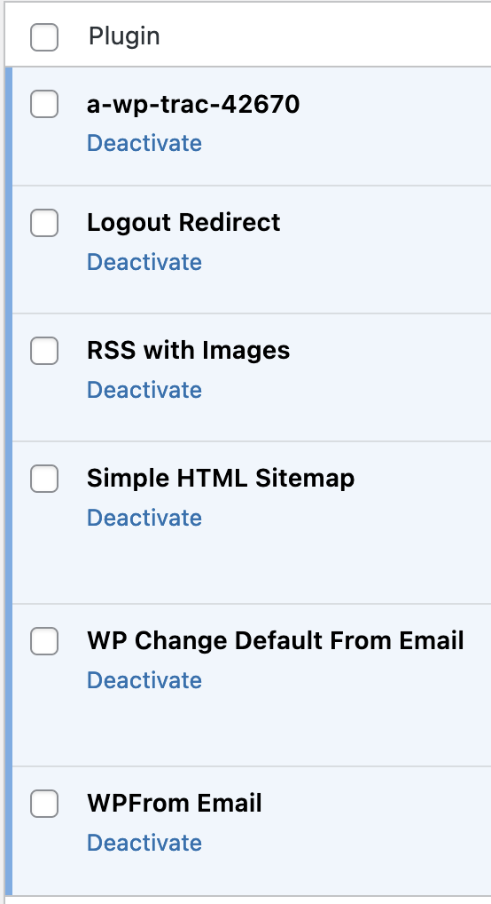
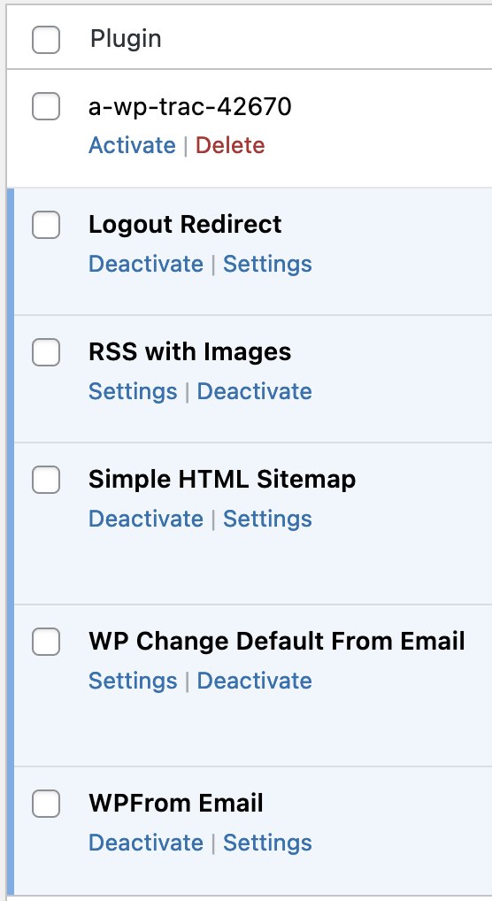
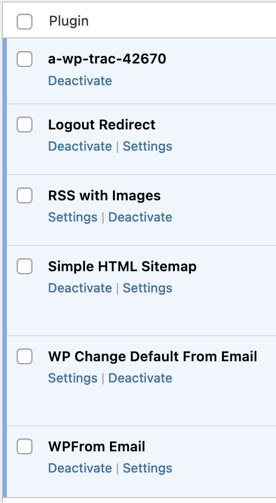

# Test instructions for WordPress Trac ticket 42670 

## Symlinked plugin makes plugin_basename function return wrong basename

These test steps require Composer, NPM and Docker.

* Ticket: [core.trac.wordpress.org/ticket/42670](https://core.trac.wordpress.org/ticket/42670)
* Patch PR: [github.com/WordPress/wordpress-develop/pull/5336](https://github.com/WordPress/wordpress-develop/pull/5336) ([previous 3412](https://github.com/WordPress/wordpress-develop/pull/3412))
* Plugins affected: [wpdirectory.net/search](https://wpdirectory.net/search/01H3G0X3ZPYCJHNGRKBTBNDMTY) (10655+)

```bash
git clone https://github.com/BrianHenryIE/a-wp-trac-42670.git;
cd a-wp-trac-42670;

wget https://github.com/WordPress/wordpress-develop/pull/5336.patch

chmod +x ./afterStart.sh
chmod +x ./single-symlink.sh
chmod +x ./double-symlink.sh

composer install;

npm install

npx wp-env start
```

It completes with `Command failed` but everything seems to be in order.

```bash
# This section can be skipped. It runs `ls` to verify the symlinks.

npx wp-env run cli ls -l /var/www/
# Note the mapped plugin file in the parent directory of the WordPress install:
# a-wp-trac-42670.php
# html

npx wp-env run cli ls -l /var/www/html/wp-content/plugins 
# Note the symlink `a-wp-trac-42670 -> /var/www/`

npx wp-env run tests-cli ls -l /var/www/
# Note the mapped file and directory in the parent directory of the WordPress install:
# a-wp-trac-42670.php
# html
# wp-content

npx wp-env run tests-cli ls -l /var/www/wp-content/plugins 
# Note the symlink `a-wp-trac-42670 -> /var/www/` 

npx wp-env run tests-cli ls -l /var/www/html/wp-content/
# Note the symlink `plugins -> /var/www/wp-content/plugins/`
```

Observe: when plugin `a-wp-trac-42670` is active, the "settings" links for the other plugins are missing.

```bash
open http://localhost:8888/wp-admin/plugins.php
open http://localhost:8889/wp-admin/plugins.php
```





```bash
# Install `patch` in wp-env.
npx wp-env run cli sudo apk add patch
npx wp-env run tests-cli sudo apk add patch

# Apply the patch
npx wp-env run cli patch -i 5336.patch -p 2 -s -N -f --no-backup-if-mismatch --reject-file=
npx wp-env run tests-cli patch -i 5336.patch -p 2 -s -N -f --no-backup-if-mismatch --reject-file=

# It will "fail" but that is the `/tests/phpunit/tests/...` part not applying.
```

Observe: the "settings" links for the other plugins are visible regardless of the status of `a-wp-trac-42670`.



```bash
# Delete the Docker containers used:
npx wp-env destroy

# Delete this test project!
$ cd ..; rm -rf a-wp-trac-42670;
```
